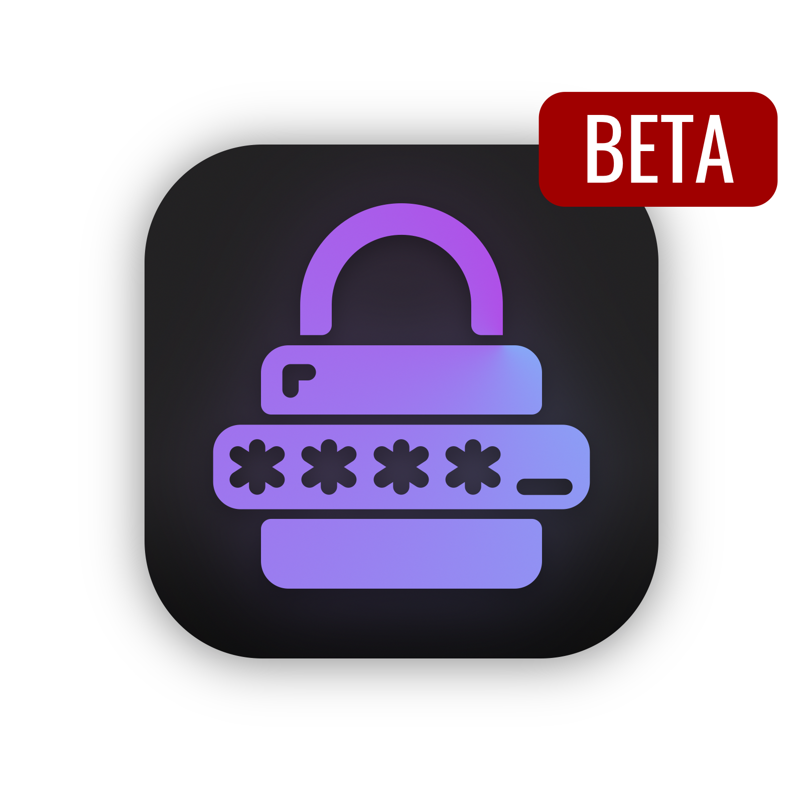
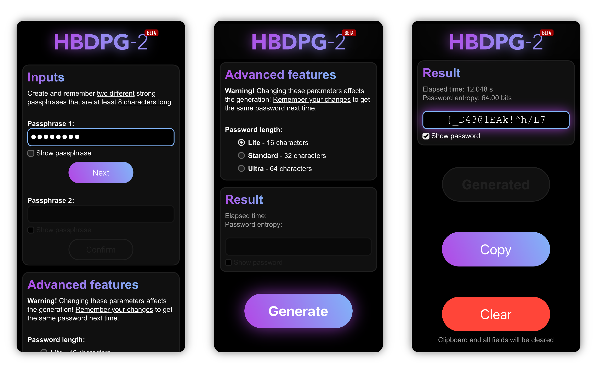
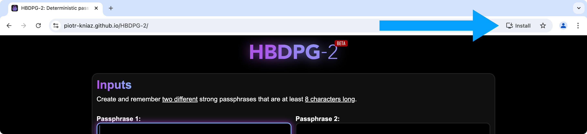

# HBDPG-2

> **Warning!** Project has been transferred to a new [repository](https://github.com/HBDPG-2/hbdpg-2.github.io).

<i><b>HBDPG-2</b> is incompatible with HBDPG-1</i>

## Contents

* [About](#about)
* [Getting started](#getting-started)
    * [Run in browser](#run-in-browser)
    * [Install application](#install-application-recommended) **(recommended)**
    * [Run locally via Live Server](#run-locally-via-live-server-for-developers-and-advanced-users) (for developers and advanced users)
* [Usage](#usage)
* [Advanced features](#advanced-features)
    * [Password length](#password-length)
    * [Custom Character Tables](#custom-character-tables) *(will be added later)*
* [Built-in security features](#built-in-security-features)
* [Risks and Recommendations](#risks-and-recommendations)
* [Feedback](#feedback)
* [Used sources](#used-sources)

## About

**HBDPG-2** *(Hashing-based Deterministic Password Generator – 2nd Gen)* is a open-source, cross-platform Web-application for deterministic password generation with a focus on security and brute-force attack resistance. The application is designed to solve the problem of creating, remembering and storing strong passwords.

Password generation is performed **on the user's device**. User secrets (passphrases, passwords, other sensitive data) are not transmitted to servers. The generated password is 32 characters long (by default) and contains uppercase letters, lowercase letters, numbers, and symbols. This meets **all modern password standards**.

The generation result is deterministic and depends on user inputs (passphrases). The generated password is **not stored anywhere!** Next time you need this password, enter your passphrases to get it again.

The algorithm has an **avalanche effect**: even a small change in the passphrase completely changes the result. You can use **small changes in passphrases** to generate **different passwords** for each account!

With HBDPG-2, **you don't have to save and remember your passwords**, making them impossible to leak!

## Getting started

**To use HBDPG-2 you will need:**
* Device with any OS *(tested on Windows, macOS, iOS, Android)*
* Any browser of the current version *(tested on Chrome, Safari, Firefox, Edge)*
* 500 MB of RAM

Please choose **one** of the following usage options:

### Run in browser

You can use HBDPG-2 via browser by following this link: https://piotr-kniaz.github.io/HBDPG-2/

### Install application (recommended)

You can install HBDPG-2 as Progressive Web App to have quick access from your Home Screen or Desktop.

1. Open https://piotr-kniaz.github.io/HBDPG-2/ in your browser.
2. In the browser menu, choose `Install HBDPG-2`:
    * On MacOS (Safari): `File` => `Add to Dock...`
    * On iOS (Safari): `Share` => `Add to Home Screen`
    * On Android (Chrome): `Menu` => `Add to Home screen` => `Install`
3. Now you can use HBDPG-2 without opening your browser!

### Run locally via Live Server (for developers and advanced users)

HBDPG-2 uses WebAssembly, which does not work if you just open `index.html` as a file in the browser. If you want to run HBDPG-2 locally, follow these steps:

1. Download and install VS Code: https://code.visualstudio.com/
2. Download and install Git (optional): https://git-scm.com/
2. Open VS Code and go to the `Extensions` section
3. Search and install `Live Server` by Ritwick Dey
4. Download HBDPG-2 source code from GitHub ([download link](https://github.com/HBDPG-2/hbdpg-2.github.io/archive/refs/heads/master.zip)) or via Terminal: `git clone https://github.com/HBDPG-2/hbdpg-2.github.io.git` (installed Git required)
5. Unzip files *(if it's an archive)*
6. Open HBDPG-2 folder in VS Code (`File` => `Open Folder...`)
7. Press `Go Live` button at the bottom of the window
8. HBDPG-2 will automatically launch in your browser!

Probably, Content Security Policy will interfere with locally running. If you encounter this problem, open `index.html` in VS Code and comment out/remove the "Content-Security-Policy" meta tag in `<head>`.

## Usage

To generate a password, you must use two passphrases that are at least 8 characters long. **Use strong passphrases** to make brute-force attacks more difficult. You can also use "Advanced features" to enhance security.

Generation is resource-intensive process that takes up to 15 seconds on average, but on some low-performance devices it can take a few minutes.

After using the generated password, **click the `Clear` button** so that your password does not remain in the clipboard!

## Advanced features

**Warning!** Changing these parameters affects the generation! **Remember your changes** to get the same password next time.

### Password length

You can choose the password length from three types:
* **Lite** – 16 characters *(minimum length recommended by CISA)*
* **Standard** – 32 characters *(default)*
* **Ultra** – 64 characters *(enhanced security)*

### Custom Character Tables

> *Will be added later...*

## Built-in security features

* **High device performance requirements** reduce generation speed and make brute-force attacks longer and more resource-intensive.

* **Using two different passphrases** to generate passwords significantly increases the possible number of combinations and make brute-force attacks more difficult.

* **Reversibility Protection** prevents the generated hash and passphrases from being revealed if your password is compromised.

* **Result Checking** ensures that the generated password meets all security requirements and standards.

## Risks and Recommendations

The main risk of using HBDPG-2 is the ability of an attacker to brute-force simple and popular passphrases to find out your password.

**Do not use weak and short passphrases!**

**Do not use HBDPG-2 on untrusted or compromised devices!**

**Do not store passphrases or passwords in plain text!** If you want to save them, use password managers or encrypt them manually (e.g. with AES).

**Use unique passwords for each account.**

**Use 2FA (MFA)** on all accounts whenever possible!

## Feedback

You can give feedback, ask a question or suggest an improvement on [this page](https://github.com/Piotr-Kniaz/HBDPG-2/discussions).

If you find a bug, you can report it on [this page](https://github.com/Piotr-Kniaz/HBDPG-2/issues).

If you have discovered a vulnerability, please read the [Security Policy](https://github.com/Piotr-Kniaz/HBDPG-2/security) and report the issue **privately!**

## Used sources

* [argon2-browser](https://github.com/antelle/argon2-browser) (commit d73916b)

---

<a href="https://github.com/Piotr-Kniaz/HBDPG-2/blob/master/LICENSE">MIT License</a>

© 2024 Piotr Kniaz

